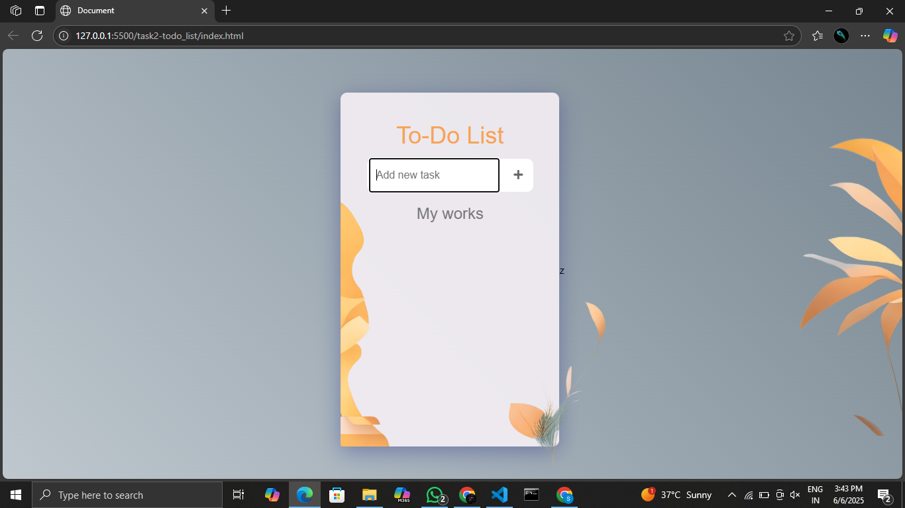

---

✅ To-Do List Web App (Front-End Only)

I built a simple and intuitive To-Do List Web App using only HTML, CSS, and Vanilla JavaScript—no frameworks, no libraries!  

Key Features:
1.Add new tasks  

2.Mark tasks as completed with a single click

3.Delete tasks

4.Responsive and minimalist UI design

Tech Stack:

HTML for structure

CSS for styling and responsiveness

Vanilla JavaScript for interactivity

Motivation:

This project helped me solidify core front-end skills like DOM manipulation, event handling, and dynamic UI updates without relying on external libraries. 
It's a great starting point for beginners or anyone brushing up on frontend fundamentals.
---
## 📸 Preview

 

